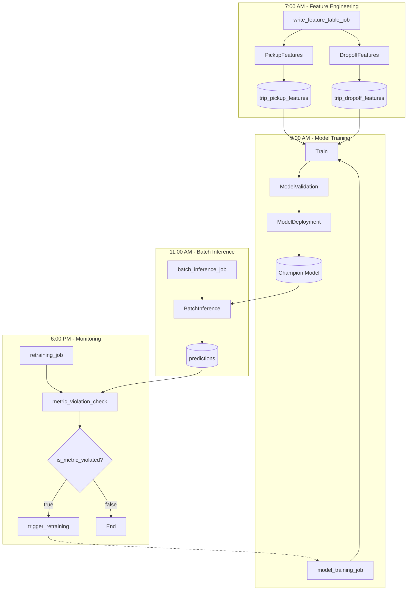
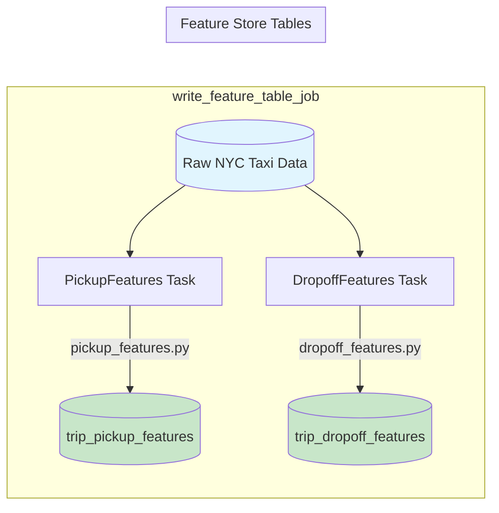
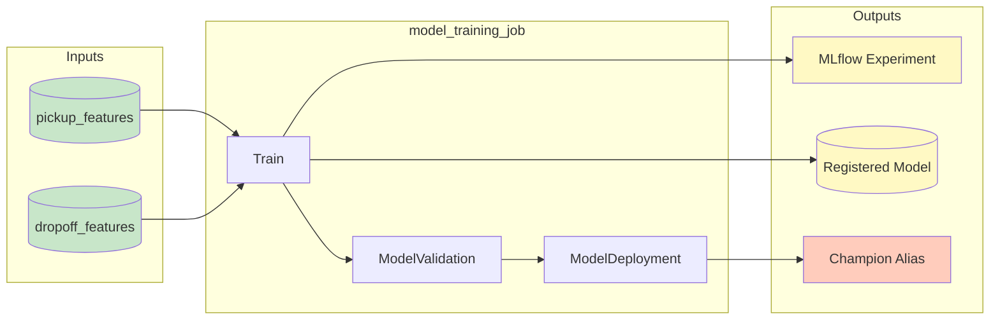
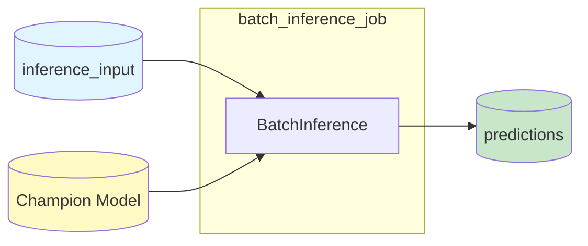
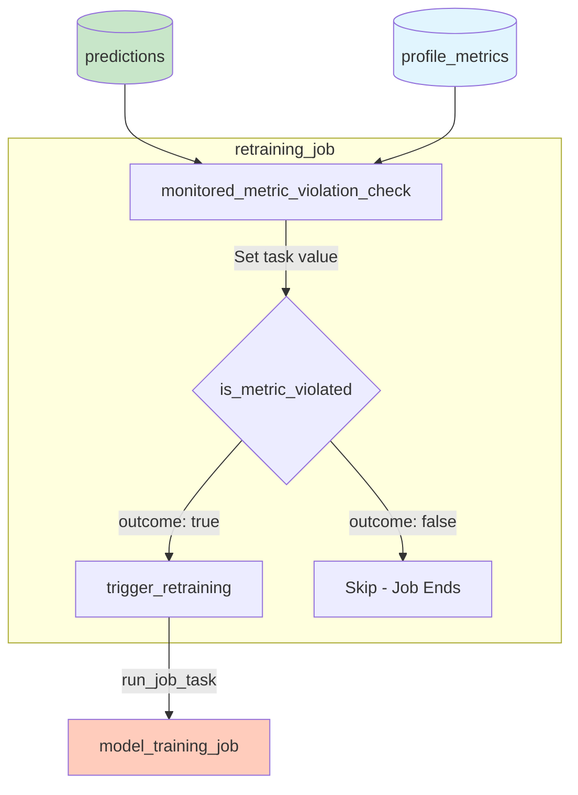

# Databricks Asset Bundle (DAB) Setup Guide

This document explains how the Databricks Asset Bundle is configured in this MLOps project.

## What is a Databricks Asset Bundle?

A **Databricks Asset Bundle (DAB)** is an "Infrastructure as Code" approach for defining and deploying Databricks resources (jobs, models, experiments, etc.) using YAML files. Think of it like Terraform but specifically for Databricks.

## File Structure Overview

```
mlops_stack_demo/
├── databricks.yml                    # Root config (entry point)
└── resources/
    ├── ml-artifacts-resource.yml     # Model & experiment definitions
    ├── feature-engineering-workflow-resource.yml  # Feature job
    ├── model-workflow-resource.yml   # Train → Validate → Deploy job
    ├── batch-inference-workflow-resource.yml      # Inference job
    └── monitoring-resource.yml       # Quality monitor & retraining job
```

---

## Bundle Configuration Files

### 1. `databricks.yml` - Root Configuration (Entry Point)

This is the main entry point for the bundle. It defines:

- **Bundle metadata**: Name and unique ID
- **Variables**: Reusable values across all resources
- **Includes**: References to resource files
- **Targets**: Deployment environments (staging, prod)

```yaml
bundle:
  uuid: e09fc1d1-51ba-417e-a059-62de3a4e3d8a
  name: mlops_stack_demo

variables:
  experiment_name:
    default: /Users/${workspace.current_user.userName}/${bundle.target}-mlops_stack_demo-experiment
  model_name:
    default: mlops_stack_demo-model
  catalog_name:
    description: The catalog name to save the trained model
  schema_name:
    description: The schema name for ML artifacts and tables.
    default: classic_ml

include:
  - ./resources/batch-inference-workflow-resource.yml
  - ./resources/ml-artifacts-resource.yml
  - ./resources/model-workflow-resource.yml
  - ./resources/feature-engineering-workflow-resource.yml

targets:
  staging:
    mode: development
    default: true
    variables:
      catalog_name: main
    workspace:
      host: https://e2-demo-field-eng.cloud.databricks.com

  prod:
    variables:
      catalog_name: fins_genai
    workspace:
      host: https://e2-demo-field-eng.cloud.databricks.com
```

#### Variable Interpolation

DAB supports variable interpolation using `${...}` syntax:

| Variable | Description | Example Value |
|----------|-------------|---------------|
| `${var.catalog_name}` | Catalog from variables | `main` or `fins_genai` |
| `${var.schema_name}` | Schema from variables | `classic_ml` |
| `${bundle.target}` | Current deployment target | `staging` or `prod` |
| `${bundle.name}` | Bundle name | `mlops_stack_demo` |
| `${workspace.current_user.userName}` | Current user | `user@company.com` |
| `${bundle.git.origin_url}` | Git repository URL | `https://github.com/...` |
| `${bundle.git.branch}` | Current git branch | `main` |

---

### 2. `ml-artifacts-resource.yml` - MLflow Model & Experiment

Defines the ML artifacts that will be created in Databricks:

```yaml
resources:
  registered_models:
    model:
      name: ${var.model_name}
      catalog_name: ${var.catalog_name}
      schema_name: ${var.schema_name}
      grants:
        - privileges: [EXECUTE]
          principal: account users

  experiments:
    experiment:
      name: ${var.experiment_name}
      permissions:
        - level: CAN_READ
          group_name: users
```

**Creates:**

| Resource | Name | Location |
|----------|------|----------|
| Registered Model | `mlops_stack_demo-model` | `{catalog}.classic_ml` |
| MLflow Experiment | `{target}-mlops_stack_demo-experiment` | User's folder |

---

### 3. `feature-engineering-workflow-resource.yml` - Feature Pipeline

Defines the job that computes and writes features to Feature Store:

```yaml
resources:
  jobs:
    write_feature_table_job:
      name: ${bundle.target}-mlops_stack_demo-write-feature-table-job
      tasks:
        - task_key: PickupFeatures
          notebook_task:
            notebook_path: ../feature_engineering/notebooks/GenerateAndWriteFeatures.py
            base_parameters:
              output_table_name: ${var.catalog_name}.${var.schema_name}.trip_pickup_features
              features_transform_module: pickup_features
        - task_key: DropoffFeatures
          notebook_task:
            notebook_path: ../feature_engineering/notebooks/GenerateAndWriteFeatures.py
            base_parameters:
              output_table_name: ${var.catalog_name}.${var.schema_name}.trip_dropoff_features
              features_transform_module: dropoff_features
      schedule:
        quartz_cron_expression: "0 0 7 * * ?"  # Daily at 7am UTC
```

---

### 4. `model-workflow-resource.yml` - Training Pipeline

Defines the model training workflow with task dependencies:

```yaml
resources:
  jobs:
    model_training_job:
      name: ${bundle.target}-mlops_stack_demo-model-training-job
      tasks:
        - task_key: Train
          notebook_task:
            notebook_path: ../training/notebooks/TrainWithFeatureStore.py

        - task_key: ModelValidation
          depends_on:
            - task_key: Train
          notebook_task:
            notebook_path: ../validation/notebooks/ModelValidation.py
            base_parameters:
              run_mode: dry_run  # dry_run | enabled | disabled

        - task_key: ModelDeployment
          depends_on:
            - task_key: ModelValidation
          notebook_task:
            notebook_path: ../deployment/model_deployment/notebooks/ModelDeployment.py

      schedule:
        quartz_cron_expression: "0 0 9 * * ?"  # Daily at 9am UTC
```

---

### 5. `batch-inference-workflow-resource.yml` - Inference Pipeline

Defines the batch scoring job:

```yaml
resources:
  jobs:
    batch_inference_job:
      name: ${bundle.target}-mlops_stack_demo-batch-inference-job
      tasks:
        - task_key: batch_inference_job
          notebook_task:
            notebook_path: ../deployment/batch_inference/notebooks/BatchInference.py
            base_parameters:
              input_table_name: ${bundle.target}.${var.schema_name}.feature_store_inference_input
              output_table_name: ${var.catalog_name}.${var.schema_name}.predictions
              model_name: ${var.catalog_name}.${var.schema_name}.${var.model_name}
      schedule:
        quartz_cron_expression: "0 0 11 * * ?"  # Daily at 11am UTC
```

---

### 6. `monitoring-resource.yml` - Quality Monitor & Retraining

Defines the quality monitor and automatic retraining job:

```yaml
resources:
  quality_monitors:
    mlops_stack_demo_quality_monitor:
      table_name: fins_genai.classic_ml.predictions
      inference_log:
        granularities: [1 day]
        prediction_col: prediction
        label_col: price
        problem_type: PROBLEM_TYPE_REGRESSION

  jobs:
    retraining_job:
      tasks:
        - task_key: monitored_metric_violation_check
          # Checks if RMSE > threshold

        - task_key: is_metric_violated
          condition_task:
            op: EQUAL_TO
            left: "{{tasks.monitored_metric_violation_check.values.is_metric_violated}}"
            right: "true"

        - task_key: trigger_retraining
          depends_on:
            - task_key: is_metric_violated
              outcome: "true"
          run_job_task:
            job_id: ${resources.jobs.model_training_job.id}

      schedule:
        quartz_cron_expression: "0 0 18 * * ?"  # Daily at 6pm UTC
```

---

## Workflow Diagrams

### Complete Daily Pipeline Overview



### Feature Engineering Job



### Model Training Job



### Batch Inference Job



### Monitoring & Retraining Job



---

## Key DAB Concepts

### YAML Anchors for Reuse (DRY)

DAB uses YAML anchors to avoid repetition:

```yaml
# Define anchor
new_cluster: &new_cluster
  new_cluster:
    num_workers: 3
    spark_version: 15.3.x-cpu-ml-scala2.12
    node_type_id: i3.xlarge

# Use anchor
tasks:
  - task_key: MyTask
    <<: *new_cluster  # Expands to full cluster config
```

### Task Dependencies

Tasks can depend on other tasks:

```yaml
tasks:
  - task_key: Train
    # No dependencies - runs first

  - task_key: Validate
    depends_on:
      - task_key: Train  # Runs after Train completes

  - task_key: Deploy
    depends_on:
      - task_key: Validate  # Runs after Validate completes
```

### Conditional Tasks

Tasks can run conditionally based on previous task outputs:

```yaml
tasks:
  - task_key: check_condition
    # Sets task value: is_violated = "true" or "false"

  - task_key: conditional_check
    condition_task:
      op: EQUAL_TO
      left: "{{tasks.check_condition.values.is_violated}}"
      right: "true"

  - task_key: action_if_true
    depends_on:
      - task_key: conditional_check
        outcome: "true"  # Only runs if condition is true
```

### Cross-Job References

Jobs can reference other jobs:

```yaml
- task_key: trigger_other_job
  run_job_task:
    job_id: ${resources.jobs.other_job.id}
```

---

## Bundle Commands

```bash
# Validate configuration
databricks bundle validate -t staging

# Deploy resources to workspace
databricks bundle deploy -t staging

# Run a specific job
databricks bundle run write_feature_table_job -t staging
databricks bundle run model_training_job -t staging
databricks bundle run batch_inference_job -t staging

# Destroy deployed resources
databricks bundle destroy -t staging
```

---

## Environment Mapping

| Target | Catalog | Schema | Workspace | Purpose |
|--------|---------|--------|-----------|---------|
| `staging` | `main` | `classic_ml` | e2-demo-field-eng | Development & testing |
| `prod` | `fins_genai` | `classic_ml` | e2-demo-field-eng | Production |

### Where is Schema Set?

The schema is defined as a **variable** in `databricks.yml`:

```yaml
variables:
  schema_name:
    description: The schema name for ML artifacts and tables.
    default: classic_ml
```

It is then used throughout the resource files:

- `${var.catalog_name}.${var.schema_name}.trip_pickup_features`
- `${var.catalog_name}.${var.schema_name}.trip_dropoff_features`
- `${var.catalog_name}.${var.schema_name}.predictions`
- `${var.catalog_name}.${var.schema_name}.${var.model_name}`

To use a different schema, override it in your target configuration:

```yaml
targets:
  staging:
    variables:
      schema_name: my_custom_schema
```

---

## Best Practices

1. **Use variables** for values that change between environments
2. **Use YAML anchors** to avoid repetition (cluster configs, permissions)
3. **Set appropriate schedules** with time gaps between dependent jobs
4. **Add permissions** to allow team access to resources
5. **Track git source info** in job parameters for traceability
6. **Use meaningful job names** with target prefix for easy identification
